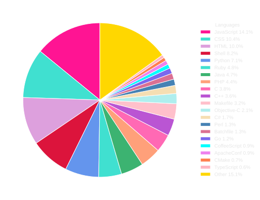
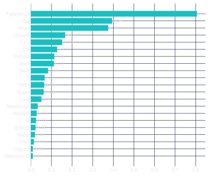
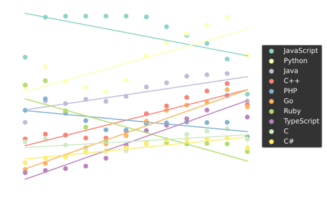
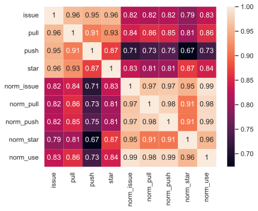

# Github langauge visualizations
Analyzing GitHub activity and language statistics.
## Graphs
### Percentage of repositories

### Issues per repository

### Projected usage

### Correlation between issues, stars, pulls, and pushes

## Data Sources
- [madnight/githut](https://github.com/madnight/githut)
- [Google's BigQuery public datasets](https://cloud.google.com/bigquery/public-data)
